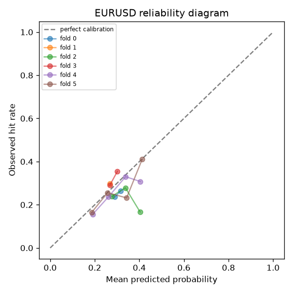
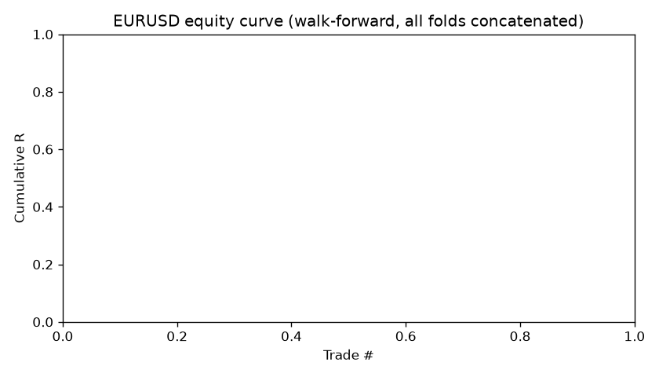
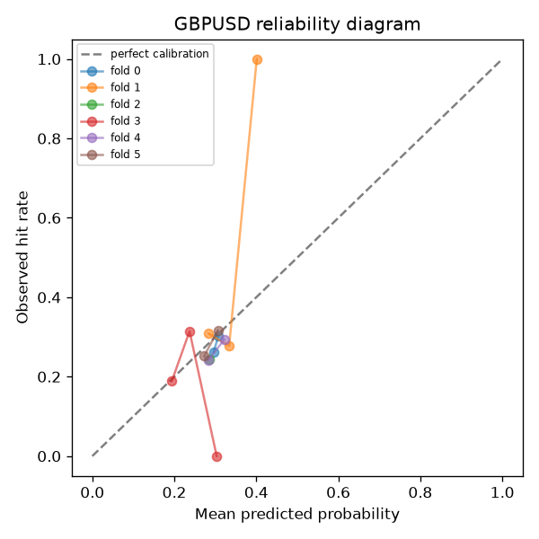
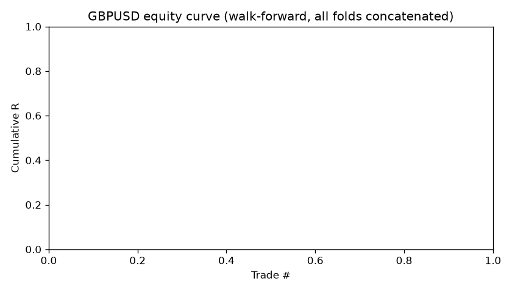
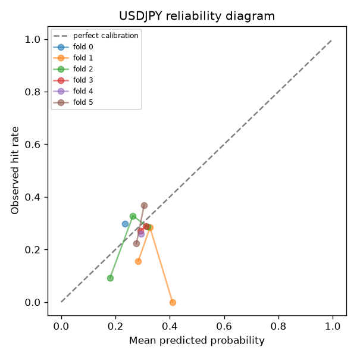
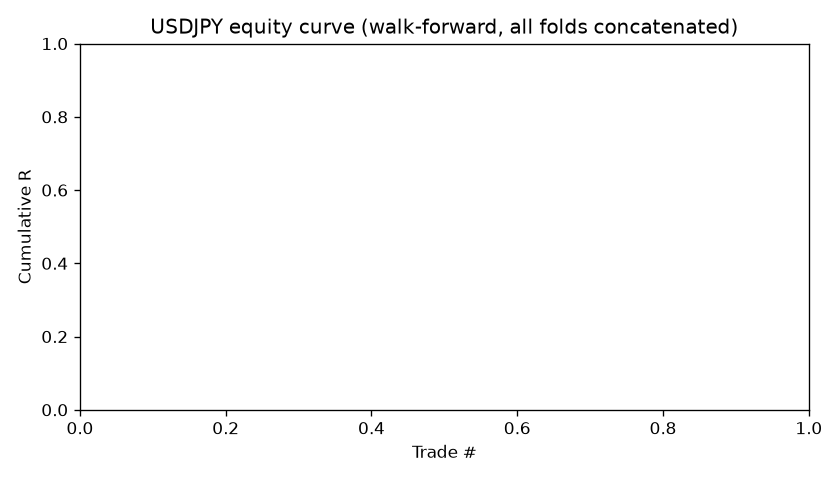

# Signal Engine Report

This report is generated by `scripts/run_signal_engine.py --train`. Read the Limitations section before treating any number here as tradeable.

## EURUSD

Data: 20000 H1 bars, 2023-06-29 to 2026-09-18 (~3.2 years).

### Headline (aggregate across all walk-forward folds)

- Total signals: **0**
- Hit rate: **nan%**
- Mean R per trade: **nan**
- Mean expectancy after costs: **nan R**
- Worst fold max drawdown: **0.00 R**

**No fold produced any signal above the probability/expectancy threshold. This is the model reporting no tradeable edge was found — a valid and honest outcome, not a bug to be tuned away.**

### Per-fold detail

| fold | test start | test end | signals | hit rate | mean R | expectancy R | max DD (R) | Sharpe | Brier | ECE | ambiguity rate |
|---|---|---|---|---|---|---|---|---|---|---|---|
| 0 | 2024-04-19 | 2024-09-12 | 0 | nan% | nan | nan | 0.00 | 0.00 | 0.1928 | 0.0526 | 1.24% |
| 1 | 2024-09-12 | 2025-02-07 | 0 | nan% | nan | nan | 0.00 | 0.00 | 0.2094 | 0.0300 | 1.20% |
| 2 | 2025-02-07 | 2025-07-04 | 0 | nan% | nan | nan | 0.00 | 0.00 | 0.1980 | 0.0528 | 0.32% |
| 3 | 2025-07-04 | 2025-11-27 | 0 | nan% | nan | nan | 0.00 | 0.00 | 0.2047 | 0.0236 | 0.48% |
| 4 | 2025-11-27 | 2026-04-24 | 0 | nan% | nan | nan | 0.00 | 0.00 | 0.1992 | 0.0170 | 0.12% |
| 5 | 2026-04-27 | 2026-09-17 | 0 | nan% | nan | nan | 0.00 | 0.00 | 0.1902 | 0.0561 | 0.72% |

### Calibration

### Equity curve

### Cost sensitivity

| cost multiplier | mean expectancy (R) |
|---|---|
| 0.5x | no signals gated in (n/a) |
| 1.0x | no signals gated in (n/a) |
| 2.0x | no signals gated in (n/a) |

No signals were gated in at *any* cost multiplier, including 0.5x (lower costs). That means the **probability threshold** is what's binding here, not the cost assumptions — even cutting costs in half didn't unlock a single signal.

### Per-year breakdown

| year | signals | hit rate | mean R |
|---|---|---|---|

### Per-regime breakdown

| regime | signals | hit rate | mean R |
|---|---|---|---|

### Null test (shuffled labels)

Shuffled-label model gated in **zero signals** on the null-test fold — nothing to evaluate here, but consistent with (not contradicting) the real model also gating in no signals on that fold: the probability threshold, not the null test, is what's binding.

## GBPUSD

Data: 20000 H1 bars, 2023-06-29 to 2026-09-18 (~3.2 years).

### Headline (aggregate across all walk-forward folds)

- Total signals: **0**
- Hit rate: **nan%**
- Mean R per trade: **nan**
- Mean expectancy after costs: **nan R**
- Worst fold max drawdown: **0.00 R**

**No fold produced any signal above the probability/expectancy threshold. This is the model reporting no tradeable edge was found — a valid and honest outcome, not a bug to be tuned away.**

### Per-fold detail

| fold | test start | test end | signals | hit rate | mean R | expectancy R | max DD (R) | Sharpe | Brier | ECE | ambiguity rate |
|---|---|---|---|---|---|---|---|---|---|---|---|
| 0 | 2024-04-19 | 2024-09-12 | 0 | nan% | nan | nan | 0.00 | 0.00 | 0.2071 | 0.0119 | 0.60% |
| 1 | 2024-09-12 | 2025-02-07 | 0 | nan% | nan | nan | 0.00 | 0.00 | 0.2062 | 0.0497 | 0.08% |
| 2 | 2025-02-07 | 2025-07-04 | 0 | nan% | nan | nan | 0.00 | 0.00 | 0.1858 | 0.0418 | 0.04% |
| 3 | 2025-07-04 | 2025-11-27 | 0 | nan% | nan | nan | 0.00 | 0.00 | 0.2176 | 0.0738 | 0.56% |
| 4 | 2025-11-27 | 2026-04-24 | 0 | nan% | nan | nan | 0.00 | 0.00 | 0.1975 | 0.0342 | 0.04% |
| 5 | 2026-04-27 | 2026-09-17 | 0 | nan% | nan | nan | 0.00 | 0.00 | 0.1905 | 0.0203 | 0.36% |

### Calibration

### Equity curve

### Cost sensitivity

| cost multiplier | mean expectancy (R) |
|---|---|
| 0.5x | no signals gated in (n/a) |
| 1.0x | no signals gated in (n/a) |
| 2.0x | no signals gated in (n/a) |

No signals were gated in at *any* cost multiplier, including 0.5x (lower costs). That means the **probability threshold** is what's binding here, not the cost assumptions — even cutting costs in half didn't unlock a single signal.

### Per-year breakdown

| year | signals | hit rate | mean R |
|---|---|---|---|

### Per-regime breakdown

| regime | signals | hit rate | mean R |
|---|---|---|---|

### Null test (shuffled labels)

Shuffled-label model gated in **zero signals** on the null-test fold — nothing to evaluate here, but consistent with (not contradicting) the real model also gating in no signals on that fold: the probability threshold, not the null test, is what's binding.

## USDJPY

Data: 20000 H1 bars, 2023-06-30 to 2026-09-18 (~3.2 years).

### Headline (aggregate across all walk-forward folds)

- Total signals: **0**
- Hit rate: **nan%**
- Mean R per trade: **nan**
- Mean expectancy after costs: **nan R**
- Worst fold max drawdown: **0.00 R**

**No fold produced any signal above the probability/expectancy threshold. This is the model reporting no tradeable edge was found — a valid and honest outcome, not a bug to be tuned away.**

### Per-fold detail

| fold | test start | test end | signals | hit rate | mean R | expectancy R | max DD (R) | Sharpe | Brier | ECE | ambiguity rate |
|---|---|---|---|---|---|---|---|---|---|---|---|
| 0 | 2024-04-19 | 2024-09-12 | 0 | nan% | nan | nan | 0.00 | 0.00 | 0.2142 | 0.0647 | 0.76% |
| 1 | 2024-09-12 | 2025-02-07 | 0 | nan% | nan | nan | 0.00 | 0.00 | 0.1949 | 0.0569 | 0.56% |
| 2 | 2025-02-07 | 2025-07-04 | 0 | nan% | nan | nan | 0.00 | 0.00 | 0.2155 | 0.0580 | 0.16% |
| 3 | 2025-07-04 | 2025-11-27 | 0 | nan% | nan | nan | 0.00 | 0.00 | 0.2046 | 0.0226 | 0.92% |
| 4 | 2025-11-27 | 2026-04-24 | 0 | nan% | nan | nan | 0.00 | 0.00 | 0.1938 | 0.0345 | 0.40% |
| 5 | 2026-04-27 | 2026-09-17 | 0 | nan% | nan | nan | 0.00 | 0.00 | 0.1802 | 0.0551 | 0.44% |

### Calibration

### Equity curve

### Cost sensitivity

| cost multiplier | mean expectancy (R) |
|---|---|
| 0.5x | no signals gated in (n/a) |
| 1.0x | no signals gated in (n/a) |
| 2.0x | no signals gated in (n/a) |

No signals were gated in at *any* cost multiplier, including 0.5x (lower costs). That means the **probability threshold** is what's binding here, not the cost assumptions — even cutting costs in half didn't unlock a single signal.

### Per-year breakdown

| year | signals | hit rate | mean R |
|---|---|---|---|

### Per-regime breakdown

| regime | signals | hit rate | mean R |
|---|---|---|---|

### Null test (shuffled labels)

Shuffled-label model gated in **zero signals** on the null-test fold — nothing to evaluate here, but consistent with (not contradicting) the real model also gating in no signals on that fold: the probability threshold, not the null test, is what's binding.

## Limitations

- **Data depth: 3.2 years, not the 5+ years the spec asked for.** The MT5 demo server (`MetaQuotes-Demo`) caps `copy_rates_from_pos` at 20,000 H1 bars regardless of the count requested — a broker/server-side history retention limit, confirmed identical across all three pairs (all start 2023-06-29/30). This likely means fewer full volatility/rate-cycle regimes are represented than the spec intended, and any per-year/per-regime breakdown above has fewer independent years to draw on than is ideal. To close this gap, pull deeper history from a dedicated data vendor (e.g. Dukascopy tick data resampled to H1, or a paid provider) rather than a demo trading account.
- **Spread/slippage cost model is a live snapshot, not historical.** H1 OHLC bars carry no historical bid/ask spread; the cost model uses the current MT5 spread as a proxy for every historical bar. Spreads widen materially around news and session opens/closes, so realized live costs will likely exceed this estimate at times — treat the reported expectancy as an upper bound, not a guarantee.
- **Ambiguous-bar resolution.** When both TP and SL fall inside the same future bar, the true intra-bar order is unknowable from OHLC alone; this is resolved conservatively as a loss. See the per-fold ambiguity rate above — if it's high for a given pair/config, results are more uncertain than the headline numbers suggest.
- **Regime classification is a simple heuristic** (ATR percentile x EMA-spread trend threshold), not a validated market-regime model. Treat per-regime breakdowns as descriptive, not as a rigorous regime-switching claim.
- **Data volume needed to detect calibration degradation:** a reliability bucket needs roughly 30-50 outcomes before its observed rate is a meaningful estimate (versus noise). At this system's typical signal rate, that implies waiting for at least several dozen live signals per pair — likely 2-4 months of paper trading — before comparing live calibration against the backtest numbers above with any confidence.
- **Backtest results do not predict live results.** Before risking real capital: run this system in paper mode long enough to accumulate the sample size above, recompute the reliability diagram and Brier score on live paper trades, and confirm they land in the same range as backtest. If live calibration is materially worse, the model has degraded or the backtest overstated the edge — do not proceed to live capital until that's resolved.
